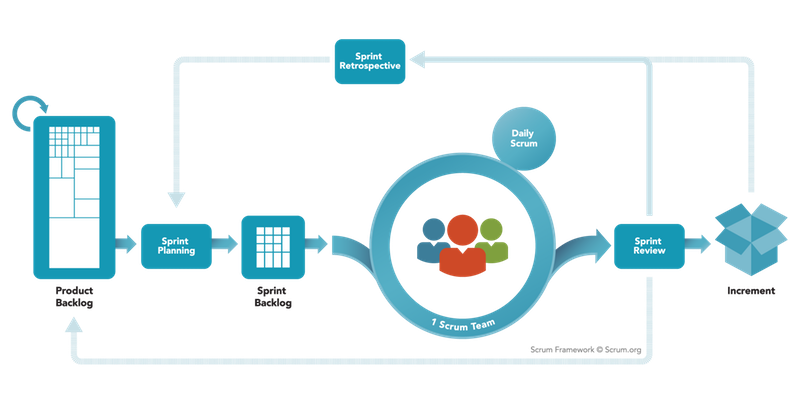

# Scrum Overview

## Cycle Diagram

## Planned Scrum Parameters

* Sprint length: 2 weeks
* Initial Sprint Schedule
    * Sprint 1: 1/18/2018 5pm - 2/1/2018 5pm
    * Sprint 2: 2/1/2018 5pm - 2/15/2018 5pm
    * Sprint 3: 2/15/2018 5pm - 3/1/2018 5pm
    * Sprint 4: 3/1/2018 5pm - 3/15/2018 5pm
    * Sprint 5: 3/15/2018 5pm - 3/29/2018 5pm
    * Sprint 6: 3/29/2018 5pm - 4/12/2018 5pm
    * Sprint 7: 4/12/2018 5pm - 4/26/2018 5pm
* Definition of “Done” for every sprint:
    * All of the tasks present in our Trello board for said sprint
    must be completed anything less than that should be considered
    a failure for said sprint.
* Documentation
    * Hours
    * Notebook
    * Portfolio
    * Artifacts collected
